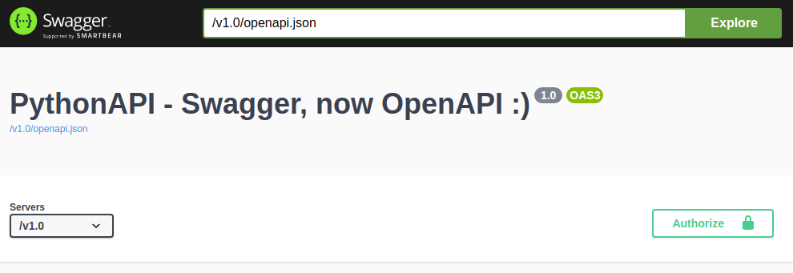

PythonAPI with Flask, OpenAPI, Connexion
======================================

This project aim to provide a simple API using Python, Flask, Connexion

 https://github.com/zalando/connexion
## Prerequisites:
  
 - To have Python 3.6+ installed 
 - To have pip installed
 
 ## Install
First, install your virtual Environment for Python

`virtualenv --python=python3 ENV_PythonAPI`

`source ENV_PythonAPI/bin/activate`

`pip install -r requirements.txt`

### Run
Run hello.py, your server will run in localhost.
To see a GUI version of the API, go to 
[http://localhost:9090/v1.0/ui/]

